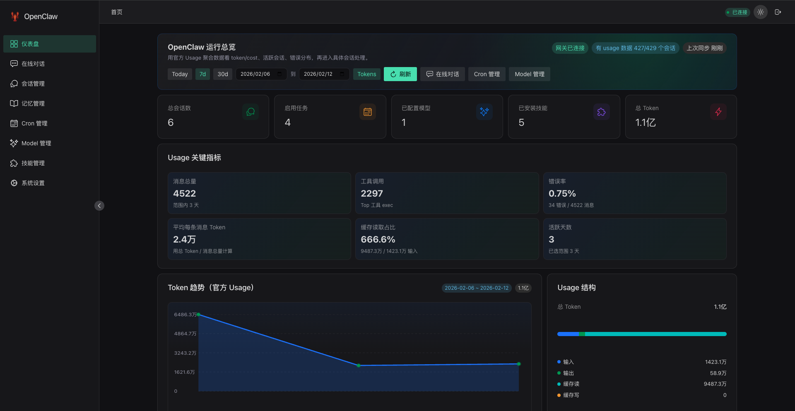

# OpenClaw Web

<p align="center"><a href="./README.md">简体中文</a> | <b>English</b></p>

OpenClaw Web is a Vue 3 + Naive UI based admin console for OpenClaw Gateway. It aims to replace the default console UI and provide a clearer operations and configuration experience.



## Features

Currently enabled modules:

- Dashboard: overview of Sessions, Cron, Skills, Models and Usage
- Chat: real-time message streaming, session switching, autocomplete for `/new`, `/skill`, `/model`
- Session management: filtering, list browsing, detail navigation
- Memory management: Agent docs directory, Markdown read/edit
- Cron management: job list, status filtering, run history, execution output inspection
- Model management: provider configuration, model probing, default model settings
- Channel management (China Edition): focuses on QQ, Feishu, DingTalk and WeCom; supports one-click remote installation and config generation via WS, account lifecycle management, policy configuration, authentication/pairing, masked credential updates, and advanced JSON extension field editing
- Skills: shows only user-created/installed skills and supports updates
- System settings: gateway address and token configuration

Kept but currently hidden entry points:

- Agent monitoring (route kept, hidden from sidebar)
- Node management page files (route not mounted)

## Tech Stack

- Vue 3 (Composition API + `<script setup>`)
- TypeScript (strict)
- Vite 7
- Pinia
- Vue Router 4
- Naive UI
- WebSocket RPC (integrates with OpenClaw Gateway)

## Version Compatibility

- The `main` branch targets OpenClaw `2026.02.14` and later.
- For OpenClaw `2026.02.13` or earlier, use the `openclaw-26.02.13` tag.

### Device Pairing Authentication for 2026.02.14+ (Must Read)

OpenClaw `2026.02.14` and later enables `devices` pairing authentication by default.  
When you connect OpenClaw Web to the Gateway for the first time, if the page shows `disconnected (1008): pairing required`, approve the device on the machine where the Gateway is running:

```bash
openclaw devices list
openclaw devices approve <requestId>
```

> Note: device auth requires a secure browser context (`crypto.subtle`). Use **HTTPS** for the frontend, or access it via `localhost/127.0.0.1`.  
> If you open the frontend via `http://<LAN-IP>`, browsers typically disable `crypto.subtle`, and the device-auth handshake will fail.

If the CLI fails with `SECURITY ERROR: Gateway URL "ws://..." uses plaintext ws:// to a non-loopback address` (common when the Gateway binds to LAN and you connect via a private IP), run the commands on the Gateway host with a loopback URL and an explicit token:

```bash
openclaw devices list --url ws://127.0.0.1:18789 --token <gateway-token>
openclaw devices approve <requestId> --url ws://127.0.0.1:18789 --token <gateway-token>
```

In some environments you may need to prefix the command with `sudo` (note: `sudo` may switch to the root config directory and therefore read a different `openclaw.json`).

You can also approve the latest pending request directly:

```bash
openclaw devices approve --latest
```

After approval, refresh the page or reconnect.  
Official docs:
- <https://docs.openclaw.ai/docs/reference/cli/devices>
- <https://docs.openclaw.ai/docs/reference/control-ui/authentication>

### Non-loopback Control UI Requires allowedOrigins for 2026.02.23+ (Must Read)

OpenClaw `2026.02.23` and later: when the Gateway is bound to a non-loopback address (for example `gateway.bind=lan` / `custom` / `tailnet`) and Control UI is enabled (`gateway.controlUi.enabled=true`), you must set `gateway.controlUi.allowedOrigins` (full origins including scheme/host/port, without path). Otherwise the Gateway will fail closed on startup or reject browser connections.

Example:

```json
{
  "gateway": {
    "bind": "lan",
    "controlUi": {
      "enabled": true,
      "allowedOrigins": [
        "http://localhost:3001",
        "https://your-domain"
      ]
    }
  }
}
```

Not recommended but available as a temporary fallback: `gateway.controlUi.dangerouslyAllowHostHeaderOriginFallback=true`.

## Quick Start

### 1. Install dependencies

```bash
npm install
```

### 2. Configure environment variables

```bash
cp .env.example .env.development
```

Edit `.env.development` as needed.

### 3. Start the dev server

```bash
npm run dev
```

Default URL: `http://localhost:3001`

Note: this is the frontend dev server URL, not the Gateway URL.

### 4. Production build

```bash
npm run build
npm run preview
```

## Environment Variables

| Variable | Default | Description |
| --- | --- | --- |
| `VITE_WS_URL` | `ws://127.0.0.1:18789` | Default Gateway URL |
| `VITE_APP_TITLE` | `OpenClaw Web` | Page title (reserved) |
| `VITE_APP_VERSION` | `0.1.0` | Client version in the `connect` handshake |

## Routes (Active)

- `/` Dashboard
- `/chat` Chat
- `/sessions` Session management
- `/sessions/:key` Session details (hidden entry)
- `/memory` Memory management
- `/cron` Cron management
- `/models` Model management
- `/channels` Channel management
- `/skills` Skills
- `/settings` System settings
- `/login` Login

Compatibility redirect routes:

- `/config` -> `/models`
- `/tools` -> `/skills`

## Connecting to OpenClaw Gateway

1. In the login page, enter the Gateway WS/WSS URL and Token.
   - Local (TLS): `wss://localhost:18789`
   - Remote (TLS): `wss://<your-domain>`
   - Local (no TLS, default dev setup): `ws://127.0.0.1:18789`
2. The app calls Gateway capabilities via a unified WebSocket RPC client.
3. The Models page follows the Gateway configuration (prefers reading `models.providers.*`).

Token example:

```bash
openclaw config get gateway.auth.token
```

## Development Notes

- Run at least the following command before committing:

```bash
npm run build
```

- If you changed UI interactions, it is recommended to manually smoke test these core flows:
  - Login -> Dashboard
  - Send messages in Chat and `/` command autocomplete
  - Channel management: add account -> save -> save & apply -> authenticate/pair
  - Model management: load configured channels and save
  - Cron: filter list, view details, run now
  - Memory: Markdown view and save

## Project Structure

```text
src/
├── api/                # WebSocket & RPC client
├── components/         # Shared components and layout components
├── composables/        # Reusable composition logic
├── layouts/            # Page layouts
├── router/             # Router configuration
├── stores/             # Pinia stores
├── utils/              # Utility functions
└── views/              # Route-level pages
```

## References

- [OpenClaw](https://github.com/openclaw/openclaw)
- [OpenClaw Docs](https://docs.openclaw.ai/)
- [Vue 3](https://vuejs.org/)
- [Naive UI](https://www.naiveui.com/)
